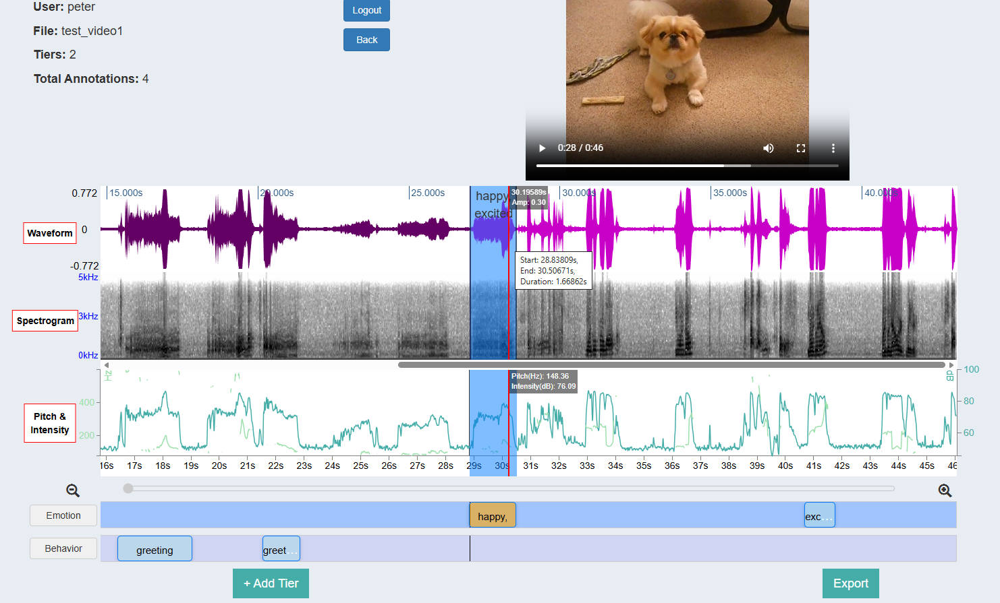

# Praat++ (An extension tool from Praat for web-based multimodal annotation)

*Praat++* is a browser-based multimodal annotation platform built on [Praat](https://www.fon.hum.uva.nl/praat/) functionality.

It provides real-time waveform, spectrogram, pitch, and intensity visualization, supporting annotation of both acoustic and video data directly in the browser with features like region labeling, tier control, and auto-saving.

## Example



## Key Features

### File Upload
- Duplicate file detection: Uploading a file with the same name will trigger a warning.
- Multiple file upload: Select and upload multiple `.wav`  `.mp3` or `.mp4` files at once.

### Waveform-Based Annotation
- Region create: Drag on the waveform to create a new annotation region.
- Region update: Resize or move regions freely.
- Playback: Click a region to play the corresponding audio.
- Timestamp preview: Hover over the waveform to view precise timing.
- Annotation: Right-click a region to add or delete labels.

### Tier Control
- Select tier: Click a tier to activate it before annotating.
- Edit tier name: Click the tier name to edit it directly.
- Hide/delete: Right-click to hide or delete a tier.

### Zoom Control
- Scroll to zoom: Use the mouse wheel over the waveform to zoom in or out.

### Custom Label Categories
- Fully customizable: Define your own annotation labels and checkbox attributes.

### Auto-Save
- All changes are auto-saved: No need for a Save button.

### Export
- Export to TextGrid: Download annotations as a `.TextGrid` file compatible with Praat.

**To explore the full features of Praat++, please refer to the [Praat++ Tutorial](https://youtu.be/-rjM8eFayUA).**

## Annotation Storage

All annotation data and files generated during processing are stored per file per user under the following structure:

```
static/videos/pool/{user}/{file_name}
```

Each uploaded file is saved under the logged-in username, and annotations persist independently per user.

## Try It Out

You can run Praat++ locally by following these steps:

### 1. Clone the Repository

```bash
git clone https://github.com/UTA-ACL2/PraatPlusPlus.git
cd PraatPlusPlus
```

### 2. Create and Activate Virtual Environment

```bash
python -m venv venv
# On Windows:
venv\Scripts\activate
# On macOS/Linux:
source venv/bin/activate
```

### 3. Install Required Packages

```bash
pip install -r requirements.txt
```

### 4. Set Up External Tools

- Install [`ffmpeg`](https://ffmpeg.org/) and ensure it is added to your system `PATH`

### 5. Configure User Accounts

Open `login_routes.py` and define allowed usernames in `VALID_ACCOUNTS`.

### 6. Run the Flask App

```bash
python run.py
```

### 7. Open in Browser

Visit http://127.0.0.1:5000 to use it.

## Contact

**Peter (Weiran Zhang)**  
Email: wxz9630@mavs.uta.edu

## Acknowledgments

This tool was inspired by the design of *Praat on the Web* (Domínguez et al., 2016).  
We gratefully acknowledge their contribution to web-based speech annotation platforms.  
*Praat++* is developed by the [ACL Lab at the University of Texas at Arlington (UTA)](https://uta-acl2.github.io/).
